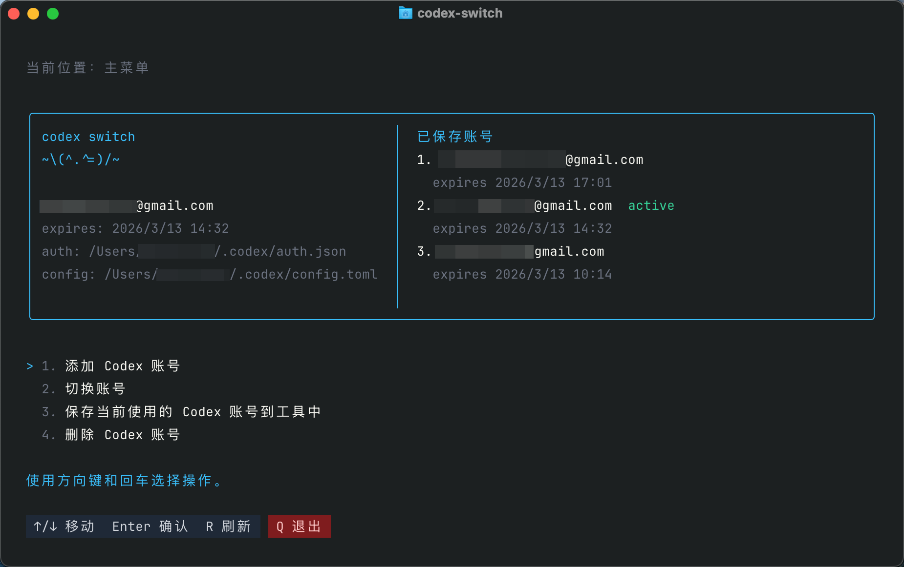
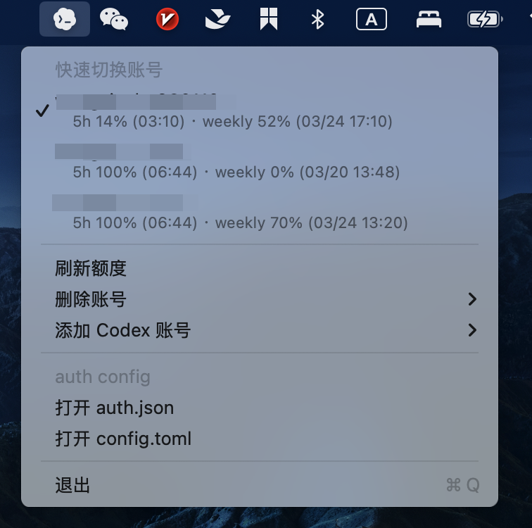

# codex-switch

`codex-switch` 是一个给 Codex 多账号切换准备的本地工具。

- 支持保存和切换多个 ChatGPT / Codex 账号快照
- 支持 macOS 原生菜单栏应用
- 支持 Node.js CLI / TUI
- 仓库已整理为 `pnpm monorepo`，包含 `apps/cli` 和 `apps/macos-menubar`

## 截图

TUI 首页：



macOS 菜单栏：



## 快速启动

### 方式 1：下载 Release

1. 打开最新 release：
[https://github.com/pinky-pig/codex-switch/releases/latest](https://github.com/pinky-pig/codex-switch/releases/latest)
2. 下载并解压 `Codex-Switch-macOS.zip`
3. 双击 `Codex Switch.app`

建议把 `Codex Switch.app` 拖到 `Applications`，以后就和普通软件一样打开。

### 方式 2：本地构建

```bash
pnpm install
pnpm build
pnpm open:app
```

构建产物：
- [`apps/macos-menubar/dist/Codex Switch.app`](/Users/wangwenbo/Desktop/demo/codex-switch/apps/macos-menubar/dist/Codex%20Switch.app)

如果你希望同时注册本地启动命令：

```bash
pnpm install:local
```

之后可以直接执行：

```bash
codex-switch
cxs
```

## 开发

要求：
- macOS
- Node.js 20+
- pnpm
- 已安装并登录过 `codex`

常用命令：

```bash
pnpm install
pnpm check
pnpm build
pnpm build:cli
pnpm build:menubar
pnpm open:app
```

工作区结构：

- `apps/cli`
- `apps/macos-menubar`
- `assets`
- `docs`

## 技术栈

### CLI / TUI

- Node.js
- TypeScript
- Commander
- React
- Ink
- tsup

### macOS 菜单栏应用

- Swift
- AppKit / `NSStatusItem`
- 原生 macOS `.app` 打包

### 历史实现

仓库里仍然保留了早期 AppleScript 方案，用于记录原型演进：

- [`apps/macos-menubar/macos/menubar-app/CodexSwitch.applescript`](/Users/wangwenbo/Desktop/demo/codex-switch/apps/macos-menubar/macos/menubar-app/CodexSwitch.applescript)

当前真正在线使用的是 Swift menubar 版本：

- [`apps/macos-menubar/macos/menubar-swift/main.swift`](/Users/wangwenbo/Desktop/demo/codex-switch/apps/macos-menubar/macos/menubar-swift/main.swift)

## 常见问题

### 1. 切换账号后为什么当前会话没变？

切换会覆盖 `~/.codex/auth.json`，但已经运行中的 VS Code、Codex 桌面端、终端会话通常不会自动热更新。切换后请重启当前会话。

### 2. 菜单栏和 CLI 用的是同一份数据吗？

是。两者都读写：

```text
~/.codex-switch/accounts/
```

### 3. `config.toml` 会一起切换吗？

默认不会。

- 普通切换只恢复 `auth.json`
- 只有在保存时带了 `--with-config`，并且切换时显式使用 `--restore-config`，才会恢复对应的 `config.toml`

### 4. 账号快照安全吗？

快照里保存的是高敏感认证信息。不要把 `~/.codex-switch/` 或项目里的 `./.codex-switch/` 提交到 git。

### 5. 如何重新全局生效最新代码？

如果你修改了项目代码，重新执行：

```bash
pnpm build
pnpm install:local
```

## Release 文档

- [`docs/releases/README.md`](/Users/wangwenbo/Desktop/demo/codex-switch/docs/releases/README.md)
- [`docs/releases/v0.1.0.md`](/Users/wangwenbo/Desktop/demo/codex-switch/docs/releases/v0.1.0.md)
